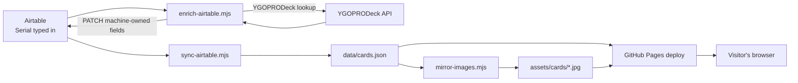

<div align="center">

# Yu-Gi-Oh! Card Collection

**A personal card collection, published as a static site from Airtable.**

[](LICENSE)
[](https://github.com/TechCabana/yugioh-card-collection)
[](#)
[](https://github.com/TechCabana/yugioh-card-collection/commits/main)

[Live site](https://techcabana.github.io/yugioh-card-collection/) ·
[Overview](#overview) ·
[Installation](#installation) ·
[Architecture](#architecture) ·
[Testing](#testing) ·
[Contributing & Licence](#contributing--licence)

</div>

---

> **TL;DR:** A static Yu-Gi-Oh! card collection site: cards are logged in
> Airtable, enriched from YGOPRODeck, and published to GitHub Pages by a
> build-time GitHub Action. The browser never talks to Airtable, so its
> write-capable token never ships to a public repo.

## Overview

This is a website that shows a personal Yu-Gi-Oh! card collection. It is plain
HTML, CSS and ES modules served from GitHub Pages, with no framework, no build
step and nothing running on a server. The collection itself is kept in
Airtable, because typing a set code into a spreadsheet-style grid on a phone
is a far better way to log a card than editing JSON.

The one constraint that shaped everything else: the repository is public, and
Airtable has no read-only public API key. Any token that reaches the browser
grants read *and* write on the whole base to anyone who views source. So the
browser never talks to Airtable. A GitHub Action does, at build time, and
commits a plain JSON file for the site to read.

### Goal

Keep a card collection somewhere pleasant to edit, publish it as a fast page
that works on a phone, and never pay for hosting or leak a credential doing
it. Adding a card should mean typing a set code and nothing else. Everything
the card already knows about itself (its name, attack, defence, attribute,
rarity) should be fetched rather than retyped.

### Scope

| In scope | Not in scope |
| --- | --- |
| Browsing, searching and filtering an owned collection | Deck building or duel simulation |
| One row per printing, keyed on set code | Price tracking or trade valuation |
| Automatic enrichment from YGOPRODeck | Public write access or user accounts |
| Static hosting on GitHub Pages | A runtime backend or database |
| Inventory data held privately in Airtable | Publishing quantities or condition |

---

## Installation

### Prerequisites

| Requirement | Version | Notes |
| --- | --- | --- |
| A web browser | any modern one | Enough to view the site |
| Node.js | 24.x | Only needed for the tests and the sync scripts |
| Git | any | |
| `gh` CLI | 2.x | Optional, for triggering the pipeline from a terminal |
| An Airtable base | | Only if you want to run the data pipeline yourself |

Viewing the site needs none of the above except a browser and a way to serve
a directory. Node is for the tooling.

### 1. Clone

```bash
git clone https://github.com/TechCabana/yugioh-card-collection.git
cd yugioh-card-collection
```

### 2. Run the site

Opening `index.html` straight from disk will not work. `assets/js/data.js`
uses `fetch()` to load `data/cards.json`, and `file://` requests fail CORS.
Serve the directory over HTTP instead:

```bash
npx serve .            # or: python -m http.server 8000
```

Open the printed URL. You should see the collection rendered from the
committed `data/cards.json`. Nothing has to be installed or configured to get
this far.

### 3. Install the tooling

```bash
npm install
```

The only dependency is Vitest, and it is there for the tests. This step is
ordered after "run the site" on purpose: viewing the collection needs no
Node dependency at all, and installing one is worth doing only once you want
the test suite or the sync scripts.

### 4. Verify

```bash
npm test
```

32 files, 957 tests, all passing. If that is what you see, the checkout is
good.

### 5. Configure Airtable

Only needed if you want to run the sync or enrichment yourself. Create a
`.env` in the repository root:

```bash
cat > .env <<'EOF'
AIRTABLE_TOKEN=
AIRTABLE_BASE_ID=
AIRTABLE_TABLE_ID=
EOF
```

| Variable | Required | Where to get it | Purpose |
| --- | --- | --- | --- |
| `AIRTABLE_TOKEN` | yes | [airtable.com/create/tokens](https://airtable.com/create/tokens) | Personal access token |
| `AIRTABLE_BASE_ID` | yes | The `app…` segment of the base URL | Which base to read and write |
| `AIRTABLE_TABLE_ID` | yes | The `tbl…` segment of the table URL | Which table within that base |

The token needs `schema.bases:read`, `data.records:read` and
`data.records:write`. Grant it access to the Yu-Gi-Oh base only. Write scope
is required because enrichment runs in the Action and PATCHes results back.

`.env` and `.env.*` are gitignored and must never be committed. CI reads the
same three names from GitHub Secrets, so the local file is only a
convenience for running a script by hand. If a token is ever exposed, revoke
it immediately at [airtable.com/create/tokens](https://airtable.com/create/tokens).
Deleting the commit does not undo the exposure.

### Everyday use

| Task | Command |
| --- | --- |
| Serve the site locally | `npx serve .` |
| Run the tests once | `npm test` |
| Run the tests on watch | `npm run test:watch` |
| Run the whole pipeline | `gh workflow run process-data.yml` then `gh run watch` |
| Preview enrichment, sending nothing | `node scripts/enrich-airtable.mjs --dry-run` |
| Enrich for real | `node scripts/enrich-airtable.mjs` |
| Enrich a capped number of rows | `node scripts/enrich-airtable.mjs --limit 5` |
| Regenerate the JSON only | `node scripts/sync-airtable.mjs` |
| Mirror any missing card art | `node scripts/mirror-images.mjs` |
| Mirror a capped number of images | `node scripts/mirror-images.mjs --limit 5` |

The pipeline can also be started from Actions, then Process Data, then Run
workflow. Use `--dry-run` before any command that writes.

Adding a card: add a row in Airtable, fill in `Serial`, `Quantity`,
`Condition` and, if you want it, `IsFirstEdition`, leave `IsProcessed`
unticked, then run the pipeline (`gh workflow run process-data.yml`, or
Actions → Process Data → Run workflow). There is no scheduled run — a daily
poll was removed on 2026-08-28, since most days add no new rows and it was
only burning Airtable API credits. Everything else is fetched.

### If it does not work

| Symptom | Cause | Fix |
| --- | --- | --- |
| Page loads but no cards appear | Opened over `file://`, so the `fetch` was blocked by CORS | Serve the directory over HTTP |
| A row never gets enriched | `IsProcessed` is already ticked | Untick it and run the pipeline again |
| Lookup fails on a valid set code | A trailing newline pasted into the multiline `Serial` field, which encodes as `%0A` | Retype the serial, or let the trim in `map-airtable.mjs` handle it |
| A row is reported as blocked | The value is not in that field's select options | Add the option manually in the Airtable UI. The API cannot create select options. |
| The workflow is green but the site is unchanged | Nothing in `data/cards.json` actually changed | Check the enrich step output for skipped rows |
| A script exits complaining about environment | `.env` missing or a variable empty | See step 5 above |

---

## Architecture

### Tools and technologies


| Layer | Choice | Why this one |
| --- | --- | --- |
| Markup and styles | Hand-written HTML and CSS | No build step means nothing sits between the source and what ships |
| Browser code | ES modules, no framework | A page of cards does not need a virtual DOM |
| Data entry | Airtable | Good mobile editing, and a real API to read it back |
| Card data | [YGOPRODeck](https://ygoprodeck.com/) API v7 | Free, keyless, covers set codes as well as card names |
| Automation | GitHub Actions | Already there, holds the secrets, and can commit to the repo |
| Hosting | GitHub Pages | Free static hosting on the same account as the source |
| Testing | Vitest | Fast, ES modules native, no configuration to run |

### How the pieces fit



<!-- ASCII fallback:
```
   you                     GitHub Actions                        visitors
    │                            │                                   │
    │  type a Serial             │                                   │
    v                            │                                   │
 Airtable ────────────────────────>                                  │
    ^                            │  enrich-airtable.mjs               │
    │                            +──> YGOPRODeck lookup               │
    │  PATCH machine-owned       │                                   │
    +────────────────────────────+                                   │
                                 │  sync-airtable.mjs                 │
                                 +──> data/cards.json (committed)     │
                                 │                                   │
                                 │  mirror-images.mjs                 │
                                 +──> assets/cards/*.jpg (committed)  │
                                 │                                   │
                                 │  actions/deploy-pages              │
                                 +──> GitHub Pages ──────────────────────+
```
-->

The browser only ever fetches the static `data/cards.json`. It never reaches
Airtable, and there is no credential anywhere in the shipped code.

### End to end walk-through

1. You add a row in Airtable and type a `Serial`, the set code printed on the
   card, for example `SDJ-017`. You also record `Quantity`, `Condition` and
   optionally `IsFirstEdition`. `IsProcessed` stays unticked.
2. The pipeline runs, triggered manually via `gh workflow run process-data.yml`
   or from the Actions tab. There is no scheduled trigger.
3. `scripts/enrich-airtable.mjs` collects every row with `IsProcessed`
   unticked and looks each set code up through `scripts/ygoprodeck-client.mjs`.
4. `scripts/enrich-ygoprodeck.mjs` maps the API response onto Airtable
   fields. It is pure, which is why it can be tested without a network.
5. The enricher PATCHes the machine-owned fields back into Airtable in
   batches of ten and ticks `IsProcessed`, so the row is never fetched again.
6. `scripts/sync-airtable.mjs` reads the whole table, paginated at 100
   records per request, and maps each record through `scripts/map-airtable.mjs`.
7. Before writing anything, the sync rejects a result that is not an array,
   is empty, is missing required fields, or still contains a private field.
   It fails the run rather than publishing bad or private data.
8. `scripts/mirror-images.mjs` downloads the art for any passcode not
   already in `assets/cards/`. It is incremental, so a run that adds no
   cards downloads nothing, and a single failed image is reported rather
   than thrown. That card falls back to a plain type-coloured block.
9. `data/cards.json` and `assets/cards/` are committed together, but only if
   something actually changed, so a card never deploys ahead of its art.
10. The same workflow uploads `index.html`, `styles.css`, `script.js`,
    `assets/` and `data/` as the Pages artifact and deploys it.
11. A visitor loads the page. `assets/js/data.js` fetches
    `data/cards.json`, `filters.js` handles search and filtering as pure
    functions, and `render.js` builds the card markup with every field
    escaped.

Blocked rows do not stop the run. Enrichment is `continue-on-error`, so the
sync, the commit and the deploy all still happen. A final step turns the run
red at the end, which means good data goes live and the problem stays
visible.

<details>
<summary><b>Why this approach, and what was rejected</b></summary>

| Decision | Alternative considered | Why the choice was made |
| --- | --- | --- |
| Fetch Airtable at build time | Fetch from the browser | Airtable has no read-only key. A token in client-side JavaScript on a public repo grants read and write on the base to anyone who views source. |
| Enrich in a GitHub Action | Airtable scripting | Airtable scripting needs a Team plan, and the code would live outside the repo with no tests, no review and no history. |
| Key on set code, not card name | Look up by name | A set code identifies one printing, which is how the collection is actually kept. Name lookup needs an exact match, and punctuation makes it fragile: `Blue Eyes White Dragon` without the hyphens returns "No card matching your query." |
| Pendulum as a boolean | Pendulum as a summon type | A card can be both Pendulum and Fusion, so a single-select could only ever record one of the two. |
| Deploy Pages from the same workflow | Let the data commit trigger `pages.yml` | GitHub deliberately blocks a push made with `GITHUB_TOKEN` from triggering further workflow runs, so that commit would land and never publish. |
| Never create select options automatically | Add missing options on the fly | Airtable's field-update endpoint accepts only `name` and `description`, so it cannot be done through the API. Keeping it manual also keeps the vocabulary deliberate. |
| Mirror card images into the repo | Hotlink YGOPRODeck per page view | YGOPRODeck asks for this, and it keeps the page working if their host is slow or unreachable. |
| Card colour derived from type, never stored | Store a `gradient` field per card | The colour follows the card's type instead of a value that has to be kept in sync by hand, and no card data reaches a style attribute at all. |

</details>

<details>
<summary><b>Data model</b></summary>

`data/cards.json` is an array of card objects, one per printing. Two rows
sharing a passcode with different serials are both kept, because
deduplicating them would quietly delete a printing from the collection.

```json
{
  "id": "rec0iHhQomPWtKsMw",
  "name": "Man-Eater Bug",
  "type": "monster",
  "rarity": "common",
  "passcode": "54652250",
  "serial": "SDP-015",
  "cardType": "Insect / Effect",
  "summonType": null,
  "hasEffect": true,
  "attribute": "Earth",
  "atk": 450,
  "def": 600,
  "level": 2,
  "isFirstEdition": false,
  "image": "assets/cards/54652250.jpg",
  "stats": [
    { "label": "ATK",   "value": "450" },
    { "label": "DEF",   "value": "600" },
    { "label": "Level", "value": "2" }
  ]
}
```

| Field | Type | Notes |
| --- | --- | --- |
| `id` | string | The Airtable record id. |
| `name` | string | Required. A record without it is dropped. |
| `type` | string | Required. `monster`, `spell`, `trap` or `token`. |
| `rarity` | string | Required. One of the keys in `RARITY_MAP` in `scripts/map-airtable.mjs`: common, short_print, super_short_print, rare, super, ultra, secret, ultimate, collector, ghost, prismatic, starlight, quarter_century. |
| `passcode` | string | Eight digits, stored as text because leading zeros are significant. Names the mirrored image file. |
| `serial` | string | Set code, trimmed. `Serial` is a multiline field in Airtable, so a pasted value can carry an invisible trailing newline that URL-encodes to `%0A` and breaks the lookup. |
| `cardType` | string | For example `Insect / Effect`. |
| `summonType` | string or null | Fusion, Synchro, XYZ, Ritual, Link, or null. |
| `hasEffect` | boolean or null | Whether a monster is an Effect monster. `null` for spells and traps, where the concept does not apply — not `false`. |
| `attribute` | string or null | Earth, Fire, and so on. |
| `atk`, `def`, `level` | number or null | Null for spells and traps. |
| `image` | string or null | Path to the mirrored art, `assets/cards/<passcode>.jpg`. Null when the passcode is missing or malformed, which is what makes the renderer fall back to a plain type-coloured block. |
| `isFirstEdition` | boolean | Whether the owner's copy is a 1st Edition print. Always present and always a boolean: an unticked Airtable checkbox arrives as `undefined`, so it is published as `false` rather than omitted. |
| `stats` | array | Three pre-built display rows. Monsters and spell or trap cards use different labels. |

**Field ownership.** A sync overwrites machine-owned fields freely and never
touches the rest.

| Machine-owned, do not type these | Human-owned, never overwritten |
| --- | --- |
| Name, Passcode, Rarity, Type, Card Type, Card Sign, Summon Type, HasEffect, IsPendulum, Attack, Defense, Level, Set Name, Set Price | Serial, Quantity, Condition, IsFirstEdition |

`IsFirstEdition` is yours because it cannot be derived. A 1st Edition and an
Unlimited copy share the same set code, and neither YGOPRODeck endpoint
reports edition. It **is** published, as the `isFirstEdition` boolean above:
the edition describes the printing anyone is looking at rather than what the
copy is worth or how many are held, so it is not inventory data. Being
human-owned and being published are separate questions: the enrichment
guard still refuses to write this field back to Airtable.

`Quantity`, `Condition` and `Set Price` are private. They are held in
Airtable and stripped before the JSON is written, because this repository is
public and those are inventory data. `sync-airtable.mjs` asserts this on
every run and fails rather than publishing them.

</details>

<details>
<summary><b>Project structure</b></summary>

```
yugioh-card-collection/
├── index.html              page shell
├── script.js                app entry, wires the DOM to the modules below
├── styles.css                everything that is not a token
├── assets/css/tokens.css     the design tokens, the only place colour is written
├── assets/js/                 browser modules
├── assets/cards/               mirrored card art, one JPEG per passcode
├── assets/fonts/                self-hosted Instrument Sans, variable woff2
├── assets/icons/                generated favicons
├── scripts/                    Node scripts, run in CI or by hand
├── data/cards.json              generated, committed, served
├── tests/                       Vitest suites, one per module
├── .github/workflows/           CI, deploy and the data pipeline
├── CLAUDE.md                    project context and working agreement (not published)
└── LICENSE                      MIT
```

| Path | Role |
| --- | --- |
| `assets/js/data.js` | Fetches and validates `data/cards.json` |
| `assets/js/filters.js` | Pure search, filter, pagination and carousel-slot logic |
| `assets/js/render.js` | Builds card markup, escaping every field |
| `assets/js/frames.js` | Derives a card frame (Normal, Effect, Ritual, Fusion, Synchro, XYZ, Link, Spell, Trap, Token) from the card type, so colour states what a card is |
| `assets/js/view.js` | Pure rules for which view is visible, given the selected view and whether the data has loaded |
| `assets/js/debounce.js` | Debounces the search input |
| `assets/js/facets.js` | Declares the filter facets, reads their values off a card, and counts each option against the other active filters |
| `assets/js/focus.js` | Index arithmetic for restoring focus after a list is rebuilt in place |
| `assets/js/toggle.js` | Sets a toggle's class and its `aria-pressed` together, so the announced state cannot drift from the visible one |
| `assets/js/keyboard.js` | Detects text-entry targets so global shortcuts do not hijack typing |
| `assets/js/sort.js` | Pure sort comparisons (name, ATK, DEF, level, rarity, set), both directions |
| `assets/js/url-state.js` | Reads and writes view, density, sort, search and facet state to the URL query string |
| `assets/js/suggest.js` | Search-suggestion matching (name, serial, passcode) and keyboard-nav index arithmetic for the combobox dropdown |
| `scripts/ygoprodeck-client.mjs` | YGOPRODeck API client, `db.ygoprodeck.com/api/v7` |
| `scripts/enrich-ygoprodeck.mjs` | Pure mapping from a YGOPRODeck response to Airtable fields |
| `scripts/enrich-airtable.mjs` | Resolves unprocessed rows and PATCHes them back |
| `scripts/map-airtable.mjs` | Pure mapping from an Airtable record to a renderable card |
| `scripts/sync-airtable.mjs` | Fetches the table and writes `data/cards.json` |
| `scripts/mirror-images.mjs` | Downloads card art into `assets/cards/`, skipping anything already mirrored |
| `scripts/make-icons.mjs` | Generates the favicon set from a single source image |
| `scripts/pipeline-report.mjs` | Turns the enrich and sync reports into the message a failed run prints, naming the real cause |
| `.github/workflows/process-data.yml` | Enrich, sync, commit and deploy. Manual trigger only (`workflow_dispatch`) — no schedule. |
| `.github/workflows/pages.yml` | Pages deploy on push to `main` |
| `.github/workflows/ci.yml` | Test gate on pull requests |

`data/cards.json` is generated. Edit Airtable and rerun the pipeline rather
than editing the file, or the next sync will overwrite your changes.

</details>

---

## Testing

```bash
npm test              # single run
npm run test:watch    # watch mode
```

### Viewing results

There is no coverage instrumentation configured. `npm test` prints a
pass/fail summary per file straight to the terminal, and that terminal
output is the full result. On a pull request, the same run appears under the
**Checks** tab (`ci.yml`); open the job's log there for the full trace
rather than just the pass/fail line on the PR itself.

| Suite | Covers |
| --- | --- |
| `data.test.js` | Fetching and validating `data/cards.json` |
| `filters.test.js` | Search, filter combinations, pagination, carousel slots |
| `render.test.js` | Card markup and escaping |
| `frames.test.js` | Card type to card frame, including a Fusion effect monster reading as Fusion rather than Effect |
| `motion.test.js` | Reads styles.css as text to enforce named transition properties, tokenised durations, and no idle animation |
| `structure.test.js` | Landmarks, the skip link, the card lists, the heading outline, and every control having a name and a state |
| `toggle.test.js` | The toggle helper, against a DOM-free stub |
| `typography.test.js` | The font is committed and self-hosted, the preload matches the @font-face, and nothing sets type outside the scale |
| `view.test.js` | Which view is visible, given the selected view and the load state |
| `sort.test.js` | Sort comparisons, both directions, including a card the field does not apply to sorting last regardless of direction |
| `url-state.test.js` | View, density, sort, search and facet state round-tripping through the URL query string |
| `suggest.test.js` | Search-suggestion matching and keyboard-nav wrap-around, including that every suggestion is itself a term the search can match |
| `debounce.test.js` | Timer behaviour of the search debounce |
| `keyboard.test.js` | Text-entry target detection |
| `facets.test.js` | Facet definitions, the exclude-own-facet counting rule, and menu counts agreeing with what filtering returns |
| `focus.test.js` | Where focus lands after a rebuilt list loses the element that held it |
| `licence.test.js` | The places the licence is stated agreeing with each other, and the bundled font licence |
| `tokens.test.js` | Reads the stylesheets as text to enforce that colour values live in `tokens.css` and nowhere else, and computes the WCAG AA contrast of every card-frame ink |
| `layout.test.js` | Guards the 59:86 card geometry against a fixed pixel height creeping back onto the art box |
| `refresh.test.js` | Cache-busted data refresh and facet re-open behaviour |
| `affordance.test.js` | Pointer cursor only appears on elements that are real controls |
| `carousel-keyboard.test.js` | Keyboard operability of the carousel slots |
| `make-icons.test.js` | Generated favicon output |
| `hygiene.test.js` | Repo-level file hygiene checks |
| `meta.test.js` | Document metadata |
| `map-airtable.test.js` | Airtable record to card mapping, including the private-field guard |
| `sync-airtable.test.js` | Pagination, the output shape, and refusal to write bad data |
| `mirror-images.test.js` | Incremental downloads, passcode validation, and per-image failure handling |
| `enrich-ygoprodeck.test.js` | YGOPRODeck response to Airtable field mapping |
| `enrich-airtable.test.js` | Row selection, batching and blocked-row reporting |
| `pipeline-report.test.js` | Which cause a failed pipeline run reports, and that a skipped serial is never described as a missing Airtable option |
| `workflows.test.js` | Action pins, the artifact/deploy major pairing, and the Node version in all three workflows |

The source tree is shaped by this. Every piece of logic worth testing was
pulled out of the DOM handlers and out of the network calls, which is why
`filters.js`, `map-airtable.mjs` and `enrich-ygoprodeck.mjs` are pure
functions that take data and return data. The suite runs without a browser
and without a network.

Current state: 32 files, 957 tests, all passing, verified on Node 24.16.0.

What the tests do not cover: the browser wiring in `script.js`, the CSS, and
the real Airtable and YGOPRODeck endpoints. Those are exercised by running
the site and by the pipeline itself. There is no end-to-end test.

Pull requests targeting `main` run this suite in CI, though a red build does
not yet block the merge. See `.github/workflows/ci.yml` for the current
gating state.

---

## Contributing & Licence

### Contributing

This is a personal project, but issues and pull requests are welcome. Open
an issue before starting anything large, so the approach can be agreed
first. Commits follow
[Conventional Commits](https://www.conventionalcommits.org/en/v1.0.0/), and
work lands on `main` through a pull request.

### Licence

Released under the MIT licence. The full text is in [LICENSE](LICENSE), and
it covers **the code in this repository only**: the HTML, CSS, JavaScript and
the Node scripts. It does not and cannot grant any rights over the card
artwork or the Yu-Gi-Oh! name, which belong to their rights holders. See the
credits below.

Relicensed from GPL-3.0 on 2026-08-11. Every commit to that point was either
the repository owner's or `github-actions[bot]`'s (the bot's commits are
the automated `data/cards.json` syncs, made on the owner's behalf and not an
independent copyright claim), so no other copyright holder's permission was
needed. Anyone who took a copy under GPL-3.0 keeps their rights under it;
MIT applies from this commit onward.

### Credits and third-party terms

- Card data and images come from [YGOPRODeck](https://ygoprodeck.com/).
  Images are mirrored at sync time rather than hotlinked per page view, at
  their request.
- *Yu-Gi-Oh!* and all card names, artwork and related marks are trademarks of
  Konami. This is an unaffiliated personal project with no endorsement from
  or association with Konami.
- The typeface is [Instrument Sans](https://github.com/Instrument/instrument-sans),
  self-hosted in `assets/fonts/` under the SIL Open Font License 1.1. Its
  licence travels with the file, in `assets/fonts/OFL.txt`.

---

<div align="center">

<sub>Built and maintained by <a href="https://github.com/TechCabana">TechCabana</a></sub>

</div>
